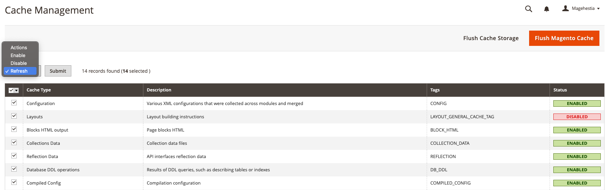

# Créer une configuration

Dans cette documentation nous allons voir ensemble comment créer une configuration dans un module Magento 2.

## Sommaire

Pour créer une configuration de module Magento 2 nous allons suivre les étapes ci-dessous :

- Etape N°1 - Créer le fichier `etc/adminhtml/system.xml`
- Etape N°2 - Créer le fichier `etc/config.xml`
- Etape N°3 - Vider le cache
- Etape N°4 - Obtenir les valeurs des configurations

## Etape N°1 - Créer le fichier etc/adminhtml/system.xml

Avant de créer le fichier `etc/adminhtml/system.xml` qui va vous permettre de créer autant de configurations que vous souhaitez nous allons voir ensemble comment se présente la page de configuration qui pour rappel se situe dans : **Store > Settings > Configuration**.


Ci-dessous une petite description rapide de ce que nous allons retrouver dans le fichier `etc/adminhtml/system.xml` :

- La partie en rouge : C'est ce que nous allons appeler dans le code **tab**.
- La partie en verte : C'est ce que nous allons appeler dans le code **section**.
- La partie en violet : C'est ce que nous allons appeler dans le code **group**.
- La partie en jaune : C'est ce que nous allons appeler dans le code **field**.


C'est le moment de créer notre fameux fichier `etc/adminhtml/system.xml` qui va nous permettre de créer nos configurations.

```file
app/code/Magehestia/Hello/etc/adminhtml/system.xml
```

Dans cette exemple nous allons tout simplement avoir un champ d'activation et un texte qui vont se trouver dans la **Magehestia**, la section **Hello** et pour finir dans le groupe **general**.

```xml title="etc/adminhtml/system.xml"
<?xml version="1.0"?>
<config xmlns:xsi="http://www.w3.org/2001/XMLSchema-instance" xsi:noNamespaceSchemaLocation="urn:magento:module:Magento_Config:etc/system_file.xsd">
    <system>
        <tab id="magehestia" translate="label" sortOrder="10">
            <label>Magehestia</label>
        </tab>
        <section id="hello" translate="label" sortOrder="130" showInDefault="1" showInWebsite="1" showInStore="1">
            <class>separator-top</class>
            <label>Hello</label>
            <tab>magehestia</tab>
            <resource>Magehestia_Hello::hello_config</resource>
            <group id="general" translate="label" type="text" sortOrder="10" showInDefault="1" showInWebsite="0" showInStore="0">
                <label>General Configuration</label>
                <field id="enable" translate="label" type="select" sortOrder="1" showInDefault="1" showInWebsite="0" showInStore="0">
                    <label>Activation</label>
                    <source_model>Magento\Config\Model\Config\Source\Yesno</source_model>
                </field>
                <field id="text" translate="label" type="text" sortOrder="1" showInDefault="1" showInWebsite="0" showInStore="0">
                    <label>Texte</label>
                    <comment>Le texte enregistré ici sera affiché sur votre page.</comment>
                </field>
            </group>
        </section>
    </system>
</config>
```

Afin de mieux comprendre le principe des configurations Magento nous allons voir ensemble à quoi sert les options disponible dans le champ field.

```xml
<field id="text" translate="label" type="text" sortOrder="1" showInDefault="1" showInWebsite="0" showInStore="0">
```

Avec Magento vous disposez d'un certain context pour vos boutiques car oui avec Magento il est possible d'avoir plusieurs boutique grâce à un seul site. Si vous n'avez pas activé l'option **Single Store** qui permet de désactiver cela alors vous pouvez lire cette partie.

Dans le field vous allez retrouver les options suivantes : 
- **showInDefault** : Permettant d'afficher la configuration dans le context Global.
- **showInWebsite** : Permettant d'afficher la configuration dans le context du Site.
- **showInStore** : Permettant d'afficher la configuration dans le context de la Boutique.

:::caution attention
Si vous utilisez un certain context pour vos configurations n'oubliez pas de le changer au moment de les remplir dans le back-office.
:::

## Etape N°2 - Créer le fichier etc/config.xml

Chaque champ dans system.xml après la création n'aura aucune valeur. Vous pouvez donc utiliser le fichier `etc/config.xml` afin de leurs définir une valeur.

```file
app/code/Magehestia/Hello/etc/config.xml
```

Veuillez trouver ci-dessous la structure du fichier que vous pouvez copier-coller si vous le souhaitez, je rappel que ce n'est pas une étape obligatoire pour faire fonctionner vos configurations.

```xml title="etc/config.xml"
<?xml version="1.0"?>
<config xmlns:xsi="http://www.w3.org/2001/XMLSchema-instance" xsi:noNamespaceSchemaLocation="urn:magento:module:Magento_Store:etc/config.xsd">
    <default>
        <hello>
            <general>
                <enable>1</enable>
                <text>Coucou mes petits loups !</text>
            </general>
        </hello>
    </default>
</config>
```

## Etape N°3 - Vider le cache

Pour vider le cache de votre Magento deux il y a deux manières de faire :
- Utiliser la ligne de commande suivante :
```bash
bin/magento cache:clear
```
- Utiliser l'interface de Magento : **System > Tools > Cache Management**



## Etape N°4 - Obtenir les valeurs des configurations

Nous avons donc maintenant nos valeurs cependant nous ne savont pas encore comment faire pour les récupérer.. Alors c'est partie !
Il faut d'abord créer un **Helper** le Helper est un dossier de votre module qui dans notre cas contient un fichier `Data.php`, ce fichier peut être appelé dans des contrôlleurs, des blocs...

```file
app/code/Magehestia/Hello/Helper/Data.php
```

Dans ce fichier nous allons nous servir de la configuration des scopes pour récupérer nos configurations.

```php title="Helper/Data.php"
<?php

namespace Magehestia\Hello\Helper;

use Magento\Store\Model\ScopeInterface;
use Magento\Framework\App\Helper\AbstractHelper;

class Data extends AbstractHelper
{
	const XML_PATH_HELLO = 'hello/';

	public function getConfigValue($field, $storeId = null)
	{
		return $this->scopeConfig->getValue(
			$field, ScopeInterface::SCOPE_STORE, $storeId
		);
	}

	public function getGeneralConfig($code, $storeId = null)
	{
		return $this->getConfigValue(
            self::XML_PATH_HELLO . 'general/' . $code, $storeId
        );
	}
}
```

Et pour illustrer un exemple nous allons récupérer nos données dans un contrôlleur :

```php
<?php

namespace Magehestia\Controller\Index;

use Magento\Framework\App\Action\Action;
use Magento\Framework\App\Action\Context;

class Index extends Action
{
    /**
     * @var HelperData
     */
	private $helperData;

    /**
     * Construct function
     *
     * @param Context $context
     * @param HelperData $helperData
     */
	public function __construct(
		Context $context,
		HelperData $helperData
	) {
		$this->helperData = $helperData;

		parent::__construct($context);
	}

	public function execute()
	{
		echo $this->helperData->getGeneralConfig('enable');
		echo $this->helperData->getGeneralConfig('text');
		exit;
	}
}
```

Et voilà vos configurations sont maintenant disponibles !